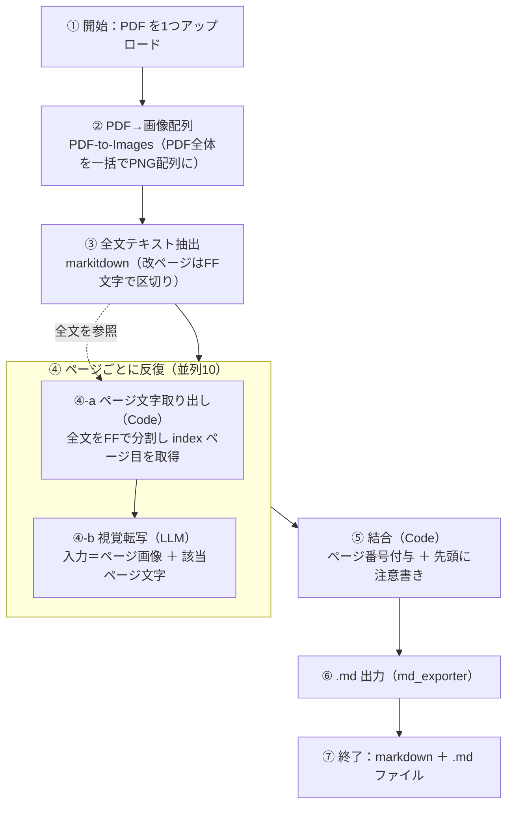

# PDF → Markdown 変換ワークフロー：処理フロー詳細

対象 DSL: [pdf-to-md-NEW.yml](./pdf-to-md-NEW.yml)（新構成・分割なし）
推奨モデル: **gpt-5.4-mini**（速度・コスト・品質のバランス最良。最網羅は gemini-3.1-pro）
使用プラグイン: **PDF-to-Images（or pdf_to_png）/ markitdown / md_exporter** ＋ LLM プロバイダー

---

## 1. 全体フロー（Mermaid）



> ④ の反復は **②の画像配列を1要素ずつ**処理し、各ページで「画像（item）」と「③の全文をFFで割った該当ページ文字」の**両方**を LLM に渡す。

> 反復(④)は **画像配列を1要素ずつ**処理。各ページで「画像(item)」と「該当ページのテキスト(③を\f分割した[index])」の**両方**を LLM に渡す。

---

## 2. ノード詳細

| # | ノード | 種類 | 入力 | 処理 | 出力 |
|---|---|---|---|---|---|
| ① | 開始 | start | — | PDF を1ファイル受け取る（`.PDF` のみ） | `file` |
| ② | PDF→画像配列 | tool (PDF-to-Images / pdf_to_png) | `start.file` | PDF全体を**一括**で各ページ PNG にレンダリング（PyMuPDF）。zoom=3 | `files`（画像の配列） |
| ③ | 全文テキスト抽出 | tool (markitdown) | `start.file` | PDF全体の**テキストレイヤー**を抽出（OCRではない）。ページ境界は **`\f`（改ページ文字）** | `text`（全文1本） |
| ④ | ページごとに反復 | iteration | 反復対象=`②.files`、並列=10 | 画像配列を1ページずつ処理 | `output`（各ページMarkdownの配列） |
| ④-a | ページ文字取り出し | code | `③.text`＋`iter.index` | `text.split("\f")[index]` でそのページのテキストだけ取得（**配列を作らない**＝後述の30要素制限を回避）。範囲外は空文字 | `page_text` |
| ④-b | 視覚転写 | llm | 画像=`iter.item`、テキスト=`④-a.page_text` | 画像を主・テキストを補助として、そのページを忠実に Markdown 化 | `text` |
| ⑤ | 結合 | code | `④.output` | 各ページに `## ページ N` を付け `\n\n---\n\n` で連結。**先頭に注意書き**を付与 | `markdown` |
| ⑥ | .md 出力 | tool (md_exporter / md_to_md) | `⑤.markdown`（mixed: `{{#join.markdown#}}`） | Markdown テキストを **.md ファイル**化 | `files` |
| ⑦ | 終了 | end | `⑤.markdown`、`⑥.files` | テキストとファイルを出力 | `markdown` / `md_file` |

### LLM(④-b) の役割分担（プロンプト要旨）
- **画像が主**：レイアウト・表・グラフ・図・吹き出し・視覚要素は画像を正とする。
- **テキストは補助**：小さい文字・数値の正確性確認用ヒント（スキャンPDFでは空のこともある）。これに引きずられて文字だけ並べない。
- **表**＝Markdownテーブルで全行、**フロー図/組織図**＝Mermaid（矢印・subgraph・中央ノード）＋**吹き出しは図内にノートで対象へ点線接続**、**目次**＝点線リーダーは簡略化しつつ全項目、要約・省略・捏造は禁止。

---

## 3. データの流れ（画像とテキストの対応づけ）

```
②PDF→画像配列 ─→ [img0, img1, ... imgN]   ← 反復対象
③markitdown  ─→ "全文 …\f… \f…"           ← \f が改ページ
                         │
④反復(index=i): item=img[i]
   ④-a: 全文.split("\f")[i]  → txt[i]
   ④-b: LLM( img[i] + txt[i] ) → md[i]
⑤結合: "## ページ1\n md0 --- ## ページ2\n md1 ..."
```
- 画像配列の **添字 i** と、テキストを `\f` で割った **i 番目** を対応づける（＝同じページ）。
- 件数がズレた場合は ④-a が空文字を返すため、**画像優先で破綻しない**。

---

## 4. 設計上の重要ポイント（なぜこの形か）

1. **`pdf_splitter` を使わない**：ドコモ環境に PDF をページ分割するプラグインが無いため。代わりに「画像配列＋全文の`\f`分割」を**添字で対応**づける。
2. **分割を反復ループ内(④-a)で行う**：Dify の **Code ノード配列出力は最大30要素**（`CODE_MAX_STRING_ARRAY_LENGTH=30`）。全ページのテキスト配列を一度に出すと**30ページ超で失敗**する。④-a で各ページ単一文字列だけ返すことで回避。
3. **画像＋テキストの両入力**：画像でレイアウト/図、テキストレイヤーで文字の正確性を担保（デジタルPDFで特に有効）。
4. **並列=10**：38ページでも数十秒。LLM呼び出しが律速（ページ数ぶん）。
5. **フロー図は Mermaid**：表に潰さず矢印・分岐・まとまり・吹き出しを保持。
6. **注意書きを先頭に付与**：自動変換物である旨と精度の限界を明記。
7. **出力は .md ファイル**：md_exporter の `md_text` は **`type: mixed` のテンプレート** `{{#join.markdown#}}` で渡す（文字列パラメータは `type: variable` だと空になるため）。

---

## 5. 出力
- `markdown`：全ページ結合済みの Markdown テキスト（プレビュー用）
- `md_file`：ダウンロード可能な単一 **.md ファイル**

---

## 6. 既知の制約・運用メモ
- **テキストはOCRではなくPDF文字レイヤー**：スキャンPDF（文字レイヤー無し）では③が空になり、④は画像のみ＝LLMのOCRに依存。
- **`\f`件数とページ数のズレ**：通常一致するが、空白ページ等で稀にズレる可能性。ズレても画像優先で内容は維持（テキストヒントがそのページで効かないだけ）。
- **件数の自己照合(旧Step5)は削除済み**：出力に検算は残さない方針。全数保証が必要なら別途「ページ数=画像数」チェックや抜き取り目視を。
- **PPTX**：今回は PDF のみ。必要なら File converter の `PPT2PDF` で PPTX→PDF にしてから流す。
