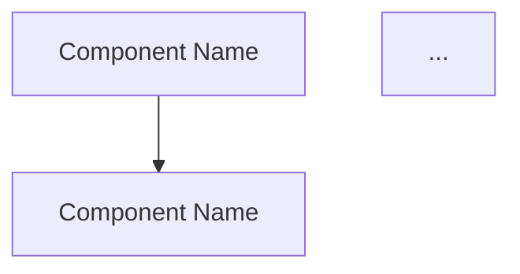

この画像はシステム構成図 / アーキテクチャ図 / コンポーネント図です。以下の形式で出力してください。

## Mermaid 表記
画像内のコンポーネントと接続を Mermaid `flowchart` で表現してください:

ルール:
- 各ボックス/コンポーネントを 1 ノードとする
- ノードラベルは画像内のテキストをそのまま使う
- 接続線（矢印・直線）の方向と種別を保持
- グルーピング（枠で囲まれたサブシステム）は `subgraph` で表現
- データベース・キュー・外部サービス等は形状を変える（`A[(Database)]`, `B[/Queue/]` 等）

## ノード一覧
表形式で全ノードを列挙:

| ID | ラベル | 種別（service/db/queue/external/...） |
|---|---|---|

## 接続一覧
表形式で全エッジを列挙:

| From | To | ラベル（プロトコル等） |
|---|---|---|

## 補足
- タイトル
- 凡例（色やアイコンの意味）
- グルーピングの名前
- その他構造化できない注釈
