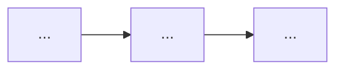

この画像は、pptx のスライドを丸ごと画像化したものです。1 枚の中に **複数の情報種別（フローチャート・グラフ・表・コード・本文テキスト）** が同居している可能性があります。以下の手順で **すべての種別を漏れなく** 抽出してください。

## Step 1: レイアウトの全体像
まずスライド全体を俯瞰し、どのようなセクション（領域）に分かれているか、各セクションに何種類の要素があるかを箇条書きで列挙してください。

## Step 2: 各セクションを専用形式で出力
セクションごとに、含まれる要素の種別を判定し、以下の専用形式で出力してください。**省略禁止**: どのセクションも飛ばさずに処理してください。

### フローチャート / プロセス図
Mermaid `flowchart` で出力:

ノードラベルは画像内の文字そのまま、接続方向を正確に。

### グラフ / チャート
Markdown table で出力:
| ラベル | 値 | 単位 | 色・強調 |
|---|---|---|---|

タイトル・軸ラベル・最大/最小値も併記。

### 表 (table)
画像内の表を完全な Markdown table に転写:
- タイトル
- ヘッダー行
- すべてのデータセル（数値・文字列を正確に）

### コード
言語を識別し、言語タグ付きコードフェンスで転写:
```<language>
...
```
ファイル名・関数名・シグネチャ・docstring も保持。

### 本文テキスト / 注釈
見出しや本文の短いテキストはそのまま引用してください。

## Step 3: 全体の主張
スライド全体が何を言おうとしているか（タイトルと本文テキストから読み取れる結論）を 1-2 文でまとめてください。

## 禁止事項
- いずれかのセクションを「省略」「簡略化」「要約」することは禁止
- 数値は必ず画像から読み取った値を使う（推測で書き換えない）
- 見えない部分を想像で補完しない
